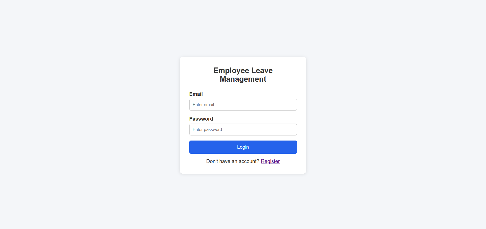
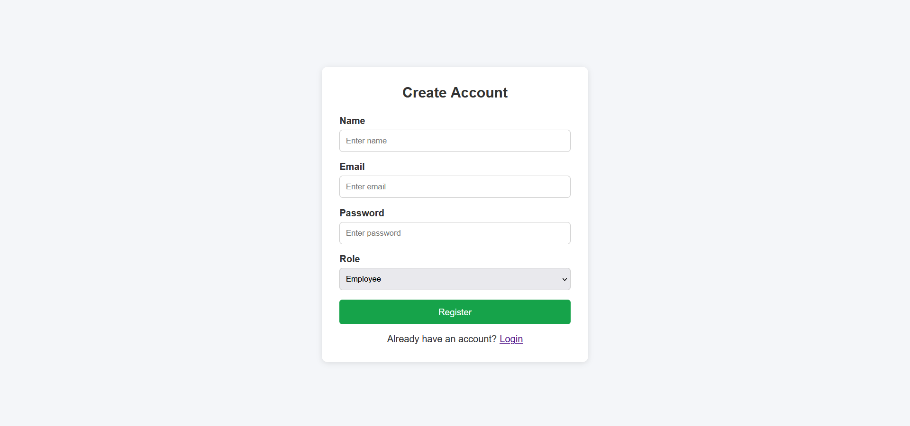
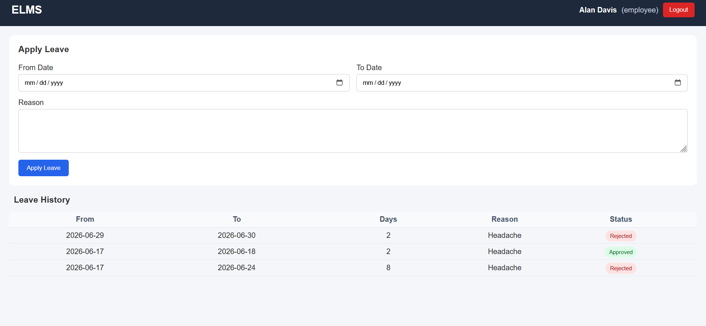
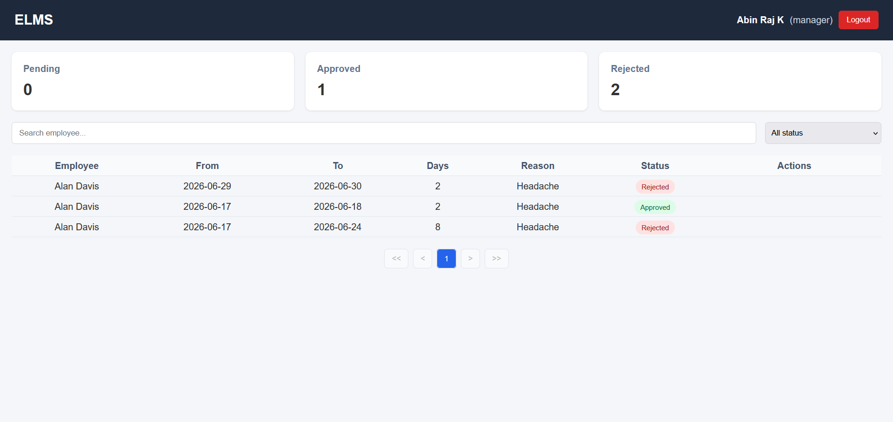

# Employee Leave Management System

A full-stack web application that allows employees to apply for leave and managers to approve or reject those requests. Built with Node.js, Express, MongoDB on the backend and React on the frontend.

---

## Table of Contents

- [Screenshots](#screenshots)
- [Setup Instructions](#setup-instructions)
- [Environment Variables](#environment-variables)
- [Application Architecture](#application-architecture)
- [API Reference](#api-reference)
- [Business Rules](#business-rules)
- [Features](#features)

---

## Screenshots

### Login


### Register


### Employee Dashboard


### Manager Dashboard


---

## Setup Instructions

### Prerequisites

- Node.js (v16 or higher)
- npm (v8 or higher)
- MongoDB Atlas account or a local MongoDB instance
- Git

### 1. Clone the Repository

```bash
git clone https://github.com/your-username/ELMS.git
cd ELMS
```

### 2. Backend Setup

```bash
cd backend
npm install
```

Create a `.env` file in the `backend/` directory with the variables listed in the [Environment Variables](#environment-variables) section.

Start the backend development server:

```bash
npm run dev
```

This uses `nodemon` to automatically restart the server on file changes. The backend will run on `http://localhost:5000` by default.

> To run without auto-restart: `npm start`

### 3. Frontend Setup

Open a new terminal window:

```bash
cd frontend
npm install
```

Create a `.env` file in the `frontend/` directory with the variables listed in the [Environment Variables](#environment-variables) section.

Start the React development server:

```bash
npm run start
```

The frontend will run on `http://localhost:3000` by default.

### 4. Running Both Simultaneously

Open two separate terminal windows — one inside `backend/` running `npm run dev`, and one inside `frontend/` running `npm run start`.

### 5. Deploying the Frontend

The frontend is configured for GitHub Pages deployment via `gh-pages`. To deploy:

```bash
cd frontend
npm run deploy
```

This builds the app and publishes it to the `gh-pages` branch. The live URL is set to:

```
https://abinrajk.github.io/EmployeeLeaveManagementSystem
```

---

## Environment Variables

### Backend (`backend/.env`)

| Variable    | Description                                      | Example Value                                                        |
|-------------|--------------------------------------------------|----------------------------------------------------------------------|
| `PORT`      | Port on which the backend server runs            | `5000`                                                               |
| `MONGO_URI` | MongoDB connection string (Atlas or local)       | `mongodb+srv://<username>:<password>@cluster0.xxxxx.mongodb.net/<db>` |
| `JWT_SECRET`| Secret key used to sign and verify JWT tokens   | `your_super_secret_jwt_key`                                          |
| `NODE_ENV`  | Application environment                          | `development`                                                        |

Example `backend/.env`:

```
PORT=5000
MONGO_URI=mongodb+srv://<username>:<password>@cluster0.xxxxx.mongodb.net/employee_leave_management
JWT_SECRET=your_super_secret_jwt_key
NODE_ENV=development
```

### Frontend (`frontend/.env`)

| Variable              | Description                                | Example Value                    |
|-----------------------|--------------------------------------------|----------------------------------|
| `REACT_APP_API_URL`   | Base URL pointing to the backend API       | `http://localhost:5000/api`      |

Example `frontend/.env`:

```
REACT_APP_API_URL=http://localhost:5000/api
```

> Do not commit `.env` files to version control. Both are listed in `.gitignore`.

---

## Application Architecture

### Overview

The application follows a standard client-server architecture with a REST API backend and a single-page application frontend.

```
ELMS/
├── backend/               # Node.js + Express REST API
│   ├── controllers/       # Route handler logic
│   ├── middleware/        # Auth middleware (JWT verification, role checks)
│   ├── models/            # Mongoose schemas (User, Leave)
│   ├── routes/            # Express route definitions
│   ├── services/          # Business logic layer
│   ├── utils/             # Helper utilities
│   ├── .env               # Backend environment variables
│   ├── server.js          # Entry point
│   └── package.json
│
└── frontend/              # React single-page application
    ├── public/
    └── src/
        ├── components/    # Reusable UI components (StatsCard, etc.)
        ├── hooks/         # Custom React hooks
        ├── pages/         # Page-level components (Dashboard, Login, Register)
        ├── routes/        # Protected route wrappers
        ├── services/      # Axios API call functions
        ├── App.js         # Root component with router setup
        ├── index.js       # React DOM entry point
        ├── .env           # Frontend environment variables
        └── package.json
```

### Backend

- **Runtime:** Node.js with Express.js
- **Database:** MongoDB via Mongoose ODM
- **Authentication:** JSON Web Tokens (JWT) via `jsonwebtoken`; passwords hashed with `bcryptjs`
- **Security:** `helmet` for HTTP headers, `express-rate-limit` for rate limiting, `cors` for cross-origin handling
- **Roles:** Two user roles — `Employee` and `Manager`. Role-based access enforced in middleware before the controller is reached
- **Dev tooling:** `nodemon` for hot-reloading during development, `morgan` for HTTP request logging

### Frontend

- **Framework:** React (Create React App)
- **Routing:** React Router DOM with protected route components that redirect unauthenticated users
- **HTTP Client:** Axios, with the base URL configured via `REACT_APP_API_URL`
- **State:** Managed with React Hooks (`useState`, `useEffect`, custom hooks)
- **Notifications:** `react-hot-toast` for success and error toast messages
- **Deployment:** `gh-pages` for GitHub Pages hosting

### Authentication Flow

1. User registers or logs in via the auth endpoints.
2. The backend validates credentials, signs a JWT, and returns it.
3. The frontend stores the token and attaches it to subsequent requests via an Axios request interceptor or header.
4. Protected routes on the frontend check for a valid token before rendering.
5. Protected API routes on the backend verify the token in middleware before processing requests.

---

## API Reference

### Auth

| Method | Endpoint              | Access  | Description              |
|--------|-----------------------|---------|--------------------------|
| POST   | `/api/auth/register`  | Public  | Register a new user      |
| POST   | `/api/auth/login`     | Public  | Login and receive a JWT  |

### Leave Management

| Method | Endpoint                    | Access   | Description                          |
|--------|-----------------------------|----------|--------------------------------------|
| POST   | `/api/leaves`               | Employee | Submit a new leave request           |
| GET    | `/api/leaves/my-leaves`     | Employee | View own leave history               |
| GET    | `/api/leaves`               | Manager  | View all employee leave requests     |
| PATCH  | `/api/leaves/:id/status`    | Manager  | Approve or reject a leave request    |

---

## Business Rules

- `fromDate` must not be later than `toDate`.
- A single leave request cannot span more than 10 days.
- Employees cannot submit overlapping leave requests.
- Only users with the `Manager` role can approve or reject requests.

---

## Features

### Employee Dashboard

- Apply for leave with date range and reason
- View personal leave history with status indicators
- Client-side form validation before submission
- Toast notifications on success or failure

### Manager Dashboard

- View all leave requests across employees
- Filter requests by status (Pending, Approved, Rejected)
- Search employees by name
- Approve or reject individual requests
- Dashboard stats showing counts for Pending, Approved, and Rejected requests
- Paginated leave list

### General

- JWT-based login with protected routes
- Responsive UI built with functional React components and hooks